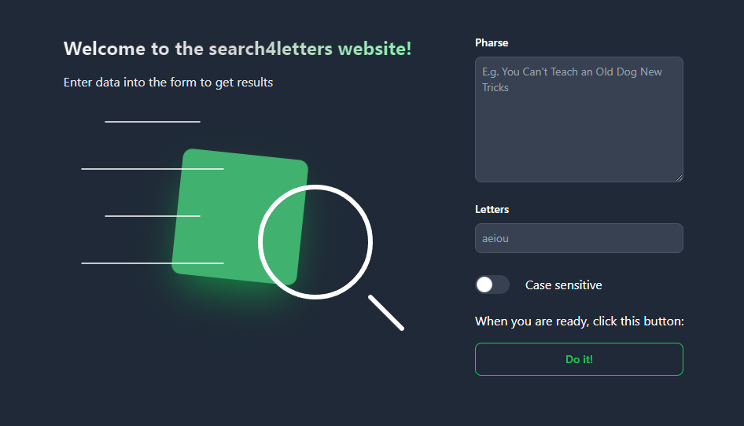

# Head First. Python
It's my Python notes to that book in Polish version:

### 
### 

I have learned a lot throughout this book. It was a long journey but worth it.

## Vsearch4Web ULTRA

One of my projects after reading this book: [vsearch4web-ultra](https://github.com/numbersanalyst/vsearch4web-ultra).

## Table of contents

    Click to see!

### 

 

Some exercises I done with [Python 3 Module of the Week](https://pymotw.com/3/index.html) and [Tech With Tim](https://www.youtube.com/@TechWithTim).

Photos are from [oreilly.com](www.oreilly.com).
